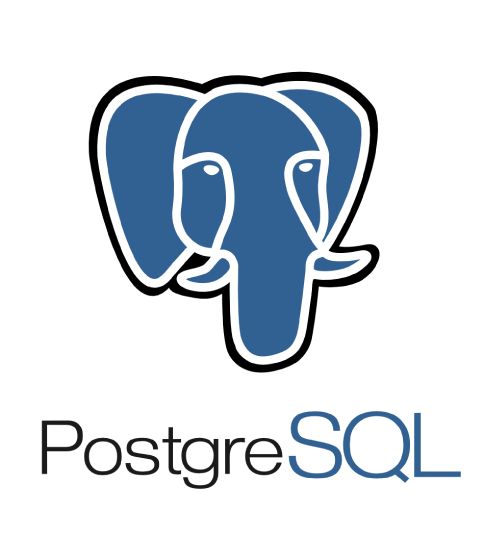
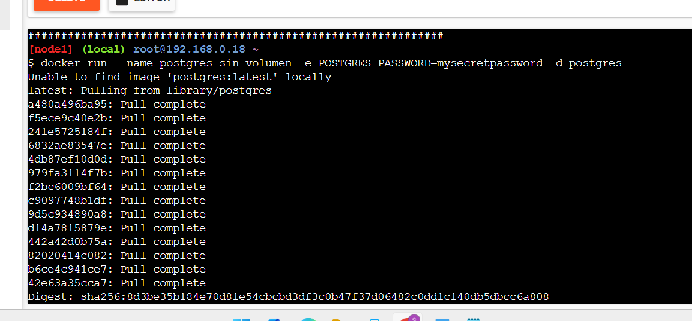
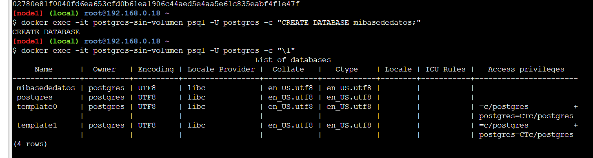
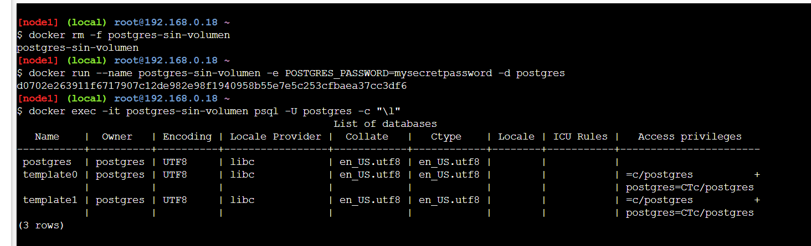
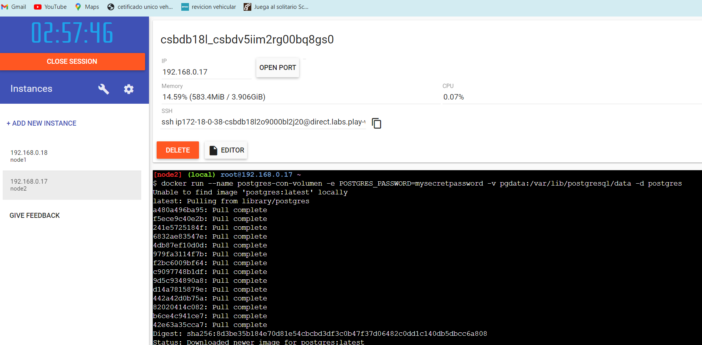
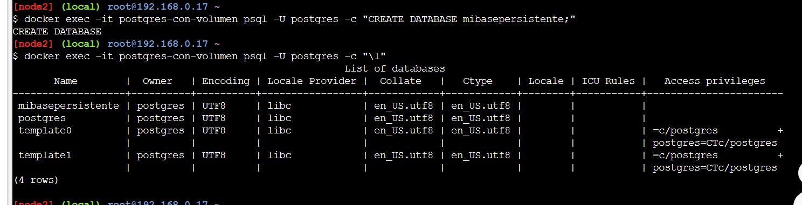
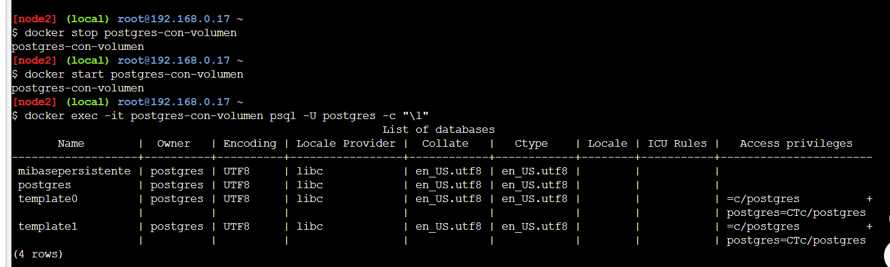

# PRÁCTICA DE CONTENEDORES 

## 1. Título
Contenedores PostgreSQL con y sin persistencia de datos

## 2. Tiempo de duración
Esta práctica se realizo en 1 hora.

## 3. Fundamentos:

PostgreSQL: es un sistema de gestión de bases de datos relacional de código abierto, escalabilidad y cumplimiento de estándares SQL.

Figura 1: Logo de PostgreSQL

Docker: es una plataforma que permite creación y ejecución de aplicaciones en contenedores. Un contenedor es una instancia ligera y portátil que incluye todo para que una aplicación funcione, como el código, las librerías y las configuraciones.

Figura 2:  Logo de Docker

## 4. Conocimientos previos
Para esta práctica es importante el conocimiento de los siguientes temas:

- Comandos básicos de Linux, Interacción con la terminal y navegación.
- Conceptos básicos de Docker
- Conocimientos básicos de SQL y bases de datos relacionales

## 5. Objetivos a alcanzar

- Implementar contenedores PostgreSQL con y sin persistencia de datos
- Comprender la diferencia entre contenedores con y sin volúmenes
- Verificar la persistencia de datos en contenedores PostgreSQL

## 6. Equipo necesario

- Computador con sistema operativo Windows/Linux/Mac
- Cuenta en Docker Play (correo institucional)
- Navegador web actualizado

## 7. Material de apoyo

- Documentación oficial de Docker
- Documentación oficial de PostgreSQL
- Guía de la asignatura (notion)

## 8. Procedimiento

Paso 1: Crear un contenedor PostgreSQL sin volúmenes

Figura 3: Creación de contenedor sin volumen

Paso 2: Crear una base de datos en el contenedor sin volumen

Figura 4: Creación de base de datos

Paso 3: Verificar la no persistencia de datos

Figura 5: Verificación de no persistencia

Paso 4: Crear un contenedor PostgreSQL con volumen

Figura 6: Creación de contenedor con volumen

Paso 5: Creación de una base de datos en el contenedor con volumen

Figura 7: Creación de base de datos en contenedor con volumen

Paso 6: Verificación de la persistencia de datos

Figura 8: Verificación de persistencia

## 9. Resultados esperados

Al finalizar la práctica, se espera observar lo sieguiente:

1. En el contenedor sin volumen: la base de datos creada no persiste después de detener y reiniciar el contenedor.
2. En el contenedor con volumen: la base de datos creada persiste incluso después de detener y reiniciar el contenedor.

## 10. Bibliografía

- Docker: Accelerated Container Application Development. (2024). Docker. https://www.docker.com/
- PostgreSQL: The World's Most Advanced Open Source Relational Database. (2024). PostgreSQL. https://www.postgresql.org/